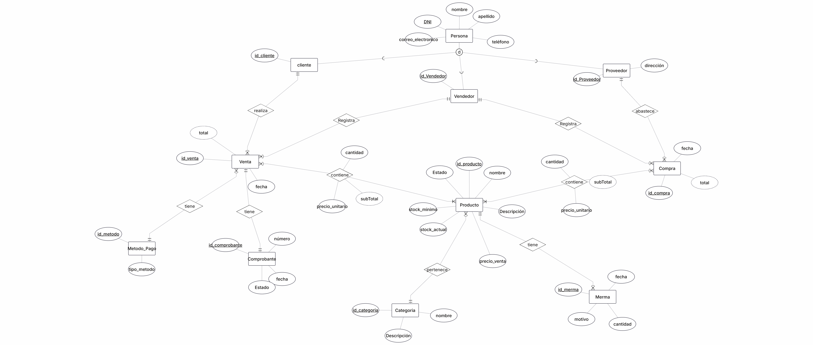

# proyecto-bd1-equipo-15
Proyecto de Base de Datos I para la gestión de ventas, stock y abastecimiento de un vivero y tienda de jardinería. incluye el diseño, normalización e implementación de la base de datoS

Este proyecto consiste en el diseño y desarrollo de una base de datos para un sistema de gestión comercial de un vivero.

El sistema permitirá administrar la información relacionada con productos, clientes, proveedores y las operaciones comerciales de compra y venta, incluyendo el control del stock y los métodos de pago.

## Objetivo

El objetivo del proyecto es diseñar una base de datos que permita gestionar de manera organizada y consistente la información relacionada con las operaciones comerciales del vivero.

Se busca garantizar la integridad de los datos y facilitar la gestión de clientes, proveedores, productos, compras, ventas y stock.

## Alcance

El sistema contempla, entre otras, las siguientes funcionalidades:

- Registro y gestión de clientes.
- Registro y gestión de proveedores.
- Gestión de productos y categorías.
- Registro de compras.
- Registro de ventas.
- Gestión de métodos de pago.
- Control y actualización del stock.
- Registro de los detalles de las operaciones.
- Generación y conservación de comprobantes.

## Documentación del proyecto

### Etapa 1 - Relevamiento y definición

[Documentación de la Etapa 1](docs/etapa-01/documentacion-etapa01.md)

### Etapa 2 - Modelo conceptual

[Modelo conceptual](docs/etapa-02/modelo-conceptual.md)

## Modelos

### Modelo conceptual

### Etapa 3 - Implementacion SQL 

[Documentacion de la etapa 3](docs/etapa-03/documentacion.sql.md)

## Codigo SQL

### DDL

## Integrantes

-Luciana Carballo
-
-
-
-

## Tecnologías y herramientas

SQL Server
SQL Server Management Studio
Git
GitHub
Markdown
ERDPlus
