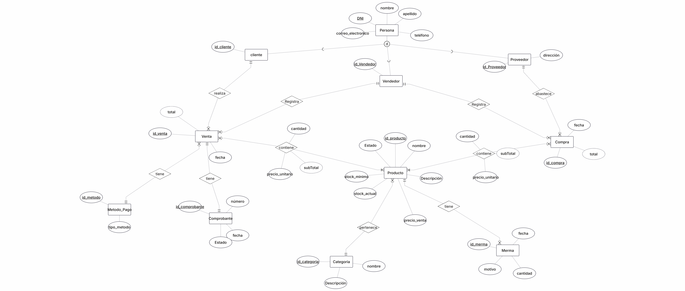

# Etapa 2 – Diseño conceptual

## 1. Luciana Carballo y Priscila Encinas

## 2. Descripción del modelo conceptual

El modelo conceptual representa la estructura de información necesaria para gestionar las principales operaciones de un vivero. En él se identifican las entidades involucradas, sus atributos y las relaciones existentes entre ellas.

El modelo contempla principalmente la gestión de productos y categorías, el registro de clientes, vendedores y proveedores, las operaciones de venta y compra, los métodos de pago, el control de las mermas y la conservación de la información relacionada con los comprobantes.

Se incorporaron elementos que permiten representar aspectos importantes del funcionamiento del sistema, como el control del stock, el registro de precios históricos utilizados en las ventas y la conservación de información de operaciones ya realizadas.

## 3. Entidades y atributos

A partir de los requerimientos y reglas de negocio definidos en la primera etapa, se identificaron las entidades necesarias para representar la información principal del sistema de gestión del vivero.

###3.1 PERSONA y sus subtipos

Se definió PERSONA como un supertipo debido a que clientes, vendedores y proveedores comparten información básica, como DNI, nombre, apellido, correo y teléfono.

A partir de este supertipo se definieron los subtipos CLIENTE, VENDEDOR y PROVEEDOR. De esta manera, los atributos comunes se mantienen una sola vez en PERSONA, evitando repetir la misma información en cada entidad.

Los subtipos incorporan además los atributos propios de cada rol:

CLIENTE: id_cliente.
VENDEDOR: id_vendedor.
PROVEEDOR: id_proveedor y dirección.

###3.2 PRODUCTO

La entidad PRODUCTO representa los artículos comercializados por el vivero. Además de identificar cada producto, permite mantener información relacionada con su precio y disponibilidad.

Entre sus atributos se encuentran precio_venta, stock_actual y stock_minimo. El atributo estado permite indicar si un producto se encuentra activo o inactivo, evitando eliminar físicamente información que pueda estar relacionada con operaciones históricas.

###3.3 VENTA

La entidad VENTA representa cada operación de venta realizada por el vivero.

Posee un identificador propio, una fecha y un total. El total se considera un atributo derivado, ya que puede obtenerse a partir de los subtotales de los productos incluidos en la venta.

###3.4 COMPRA

La entidad COMPRA representa las operaciones mediante las cuales el vivero adquiere productos para su abastecimiento.

Posee un identificador, una fecha y un total, considerado también un atributo derivado cuando se obtiene a partir de los productos y cantidades involucradas en la compra.

###3.5 METODO_PAGO

La entidad METODO_PAGO permite representar las diferentes formas mediante las cuales puede abonarse una venta, como efectivo, débito, crédito o transferencia bancaria.

###3.6 CATEGORIA

La entidad CATEGORIA permite organizar los productos según su clasificación dentro del vivero. Cada producto pertenece a una categoría.

###3.7 MERMA

La entidad MERMA permite registrar las pérdidas de productos que no corresponden a una venta, por ejemplo, debido a deterioro, plagas o daños.

Sus atributos principales son la fecha, la cantidad perdida y el motivo de la merma. Su incorporación permite mantener un registro de las salidas de stock que no corresponden a operaciones de venta.

###3.8 COMPROBANTE

La entidad COMPROBANTE permite conservar la información correspondiente a los comprobantes generados por las operaciones de venta.

Sus atributos permiten identificar el comprobante, registrar su fecha y conservar su estado, incluyendo situaciones en las que una operación sea posteriormente anulada.

## 5. Elementos especiales del modelo

Durante la elaboración del modelo conceptual se utilizaron diferentes elementos y características del modelo entidad-relación para representar de manera adecuada los requerimientos del sistema.

### 5.1 Supertipo y subtipos

Se utilizó **PERSONA** como supertipo y **CLIENTE**, **VENDEDOR** y **PROVEEDOR** como subtipos.

Esta decisión permite agrupar en PERSONA los atributos que son comunes a los tres roles, evitando repetir información como nombre, apellido, DNI, correo y teléfono.

Cada subtipo incorpora los atributos específicos correspondientes al rol que representa.

### 5.2 Atributos derivados

En el modelo se identificaron atributos cuyo valor puede obtenerse a partir de otros datos.

Por ejemplo, el **total de una venta** puede calcularse a partir de los subtotales de los productos incluidos en ella. De forma similar, el total de una compra puede obtenerse a partir de los productos y cantidades registrados en la operación.

También se considera derivado el atributo **subtotal** de la relación entre VENTA y PRODUCTO , ya que se obtiene mediante la cantidad del producto multiplicada por el precio unitario correspondiente.

### 5.3 Identificadores

Cada entidad posee un atributo o conjunto de atributos que permite identificar de manera única cada instancia.

Entre los identificadores definidos se encuentran id_venta, id_compra, id_producto, id_categoria, id_metodo, id_merma e id_comprobante.

En el caso de PERSONA, se utiliza el **DNI** como identificador, mientras que los subtipos poseen sus propios identificadores, como id_cliente, id_vendedor e id_proveedor.

### 5.4 Estados activo e inactivo

Se incorporó el atributo **estado** en `PRODUCTO` para poder distinguir entre productos activos e inactivos.

Esta decisión permite conservar la información de productos que hayan participado en operaciones históricas sin necesidad de eliminarlos físicamente del sistema.

De esta manera, se preserva la información histórica de las operaciones realizadas y se evita perder referencias a datos utilizados anteriormente.

## 6. Diagrama conceptual

A continuación se presenta el diagrama entidad-relación correspondiente al modelo conceptual desarrollado para el sistema de gestión del vivero.

El diagrama representa las entidades, atributos, relaciones y cardinalidades definidas a partir de los requerimientos y reglas de negocio establecidos para el sistema.

## 7. Trabajo realizado por cada integrante

### 7.1 Integrante 1: participación en la identificación y definición de entidades, atributos y especialización del modelo.

